# Framework de Explicabilidade de Indicadores de Qualidade de Telecomunicações

> Segmentação e explicabilidade dos **5.570 municípios brasileiros** por qualidade de serviços de telecomunicações — combinando K-Means, HDBSCAN, LOF e SHAP sobre dados RQUAL (Anatel) e IBGE.

---

## Resumo

Este trabalho apresenta um framework analítico de múltiplas camadas para segmentar e explicar a qualidade de serviços de telecomunicações nos 5.570 municípios brasileiros. Combinando indicadores RQUAL (Anatel) com dados socioeconômicos e geográficos do IBGE, aplicamos K-Means (K=5, silhouette=0,831) para identificar cinco perfis municipais distintos — de capitais metropolitanas a municípios norte-amazônicos com cobertura crítica. Sobre essa segmentação, aplicamos HDBSCAN para descoberta de sub-estruturas por coesão de grupo, LOF para detecção de anomalias individuais, e SHAP sobre um modelo surrogate (Random Forest, accuracy=95,0% ± 0,6%) para explicar quais variáveis definem cada perfil. O achado central é que **a classificação de municípios norte-amazônicos é determinada pela extensão territorial (|SHAP|=0,355), não pelos indicadores de serviço** — e que municípios do Nordeste são identificados geograficamente com precisão equivalente à de seus indicadores socioeconômicos. Os resultados subsidiam priorização regulatória e políticas de investimento diferenciadas por perfil territorial.

---

## 1. Introdução

A Anatel publica anualmente o **RQUAL** — um sistema de 8 indicadores que medem a qualidade dos serviços de telecomunicações por município: taxa de reclamações, atendimento, resolução no prazo, disponibilidade, velocidade de download, cobertura de infraestrutura e throughput. O Brasil, porém, é um território de extremos: os 5.570 municípios variam de capitais com densidade de 13.000 hab/km² a municípios amazônicos com área superior à da Bélgica e economia essencialmente primária. Aplicar políticas regulatórias uniformes sobre essa heterogeneidade significa tratar Curitiba e Tefé (AM) pelo mesmo instrumento.

**A pergunta central deste framework:** *É possível segmentar os municípios brasileiros em perfis coerentes que expliquem, simultaneamente, sua qualidade de telecom e seu contexto socioeconômico-territorial?*

Para respondê-la, construímos um pipeline em 10 etapas — da coleta e integração de dados até a explicabilidade individual por município via SHAP. O resultado não é apenas uma classificação: é uma **tipologia regulatória** com identificação de exceções e rastreabilidade de decisão para cada um dos 5.570 municípios.

---

## 2. Dados

### 2.1 Fontes

| Fonte | Provedor | Cobertura | Volume |
|-------|----------|-----------|--------|
| RQUAL | Anatel (dados abertos) | 2022–2025, todos os estados | 5,96M linhas |
| PIB Municipal | IBGE | 5.570 municípios, 2021 | — |
| Censo demográfico | IBGE | 5.570 municípios, 2022 | — |
| Taxa de urbanização | IBGE | 5.570 municípios, 2022 | — |
| IDHM | PNUD/Atlas Brasil | 5.570 municípios, 2010 | — |
| Geometria municipal | IBGE via geobr | 5.570 municípios, 2020 | — |

**Chave de integração:** `cod_mun` — código IBGE de 7 dígitos. Preferido sobre nome do município por ser numérico e padronizado (evita inconsistências como "São Luís" vs "Sao Luis").

### 2.2 Indicadores RQUAL

| Indicador | Descrição | Interpretação |
|-----------|-----------|---------------|
| IND2 | Taxa de Reclamações | Menor = melhor |
| IND4 | Taxa de Atendimento | Maior = melhor |
| IND5 | Taxa de Solução no Prazo | Maior = melhor |
| IND8 | Disponibilidade do Serviço | Maior = melhor |
| IND9 | Velocidade de Download | Maior = melhor |
| INF1 | Cobertura/Infraestrutura | Maior = melhor |
| INF4-UP | Throughput Upload | Maior = melhor |

### 2.3 Variáveis socioeconômicas (IBGE)

`pib_per_capita`, `pib_agropecuaria`, `pib_industria`, `pib_servicos`, `pop_total`, `pop_rural`, `densidade`, `area_km2`, `tx_urbanizacao`, `idhm`, `lat`, `lon` + dummies regionais (Norte, Nordeste, Centro-Oeste, Sul/Sudeste).

---

## 3. Metodologia

### 3.1 Visão geral do pipeline

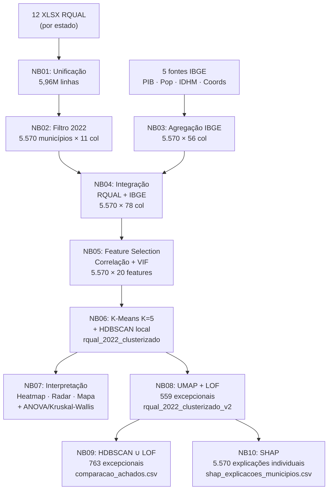

### 3.2 Feature Selection (NB05)

A partir de 78 variáveis brutas, o pipeline de seleção reduziu para **20 features** em 6 etapas com logs de auditoria:

| Etapa | Método | Resultado |
|-------|--------|-----------|
| **1. Higienização** | Remoção de constantes e quasi-constantes (≥99% dominância) | 41 variáveis avaliadas → 40 mantidas |
| **2. Imputação** | Mediana por UF com fallback mediana global | 4 variáveis socioeconômicas imputadas |
| **3. Robustez** | Winsorização 1%–99% para variáveis com \|skew\| > 2 | IND2, IND4, IND8 e outras |
| **4. Z-score** | Padronização (média=0, desvio=1) | Todas as features numéricas |
| **5. Correlação** | Remoção de pares \|ρ\| ≥ 0,80 (preservando os 8 RQUAL) | **20 variáveis removidas** |
| **6. VIF iterativo** | Remoção até VIF ≤ 5,0 (tolerância 10,0 para RQUAL) | **1 variável removida** (`URB__Total`, VIF=5,28) |

**Features finais (20):** 7 indicadores RQUAL · PIB agropecuário · PIB industrial · PIB per capita · área · densidade · população rural · IDHM · lat · lon · 4 dummies regionais

### 3.3 Clustering K-Means (NB06)

- **Scaler:** RobustScaler — fração de outliers medida: 2,47% (acima do limiar de 2% para preferir Robust sobre Standard)
- **Avaliação:** K=2 a K=12, 5 seeds aleatórias (42, 7, 123, 2025, 99), 25 inicializações por rodada
- **Rank ponderado:** Calinski-Harabász ×2,0 + Davies-Bouldin ×1,5 + Silhouette ×1,2 + Inércia ×1,0

| K | Silhouette | Calinski-Harabász | Score ponderado |
|---|:---:|:---:|:---:|
| 2 | 0,831 | 5.659 | −18,7 ✓ melhor silhouette |
| **5** | **0,620** | **4.159** | **−28,3 ✓ escolhido** |
| 12 | 0,156 | 3.266 | −51,5 |

**Por que K=5 e não K=2?** K=2 tem o maior silhouette, mas produz apenas dois macro-grupos (Sul/Sudeste vs restante), perdendo as nuances do Nordeste, Norte e Capitais. K=5 equilibra separação com granularidade interpretativa.

### 3.4 Detecção de Municípios Excepcionais (NB08 + NB09)

Três abordagens testadas para identificar municípios que fogem do padrão do seu próprio cluster:

| Abordagem | Taxa de ruído | Municípios | Papel |
|-----------|:---:|:---:|-------|
| HDBSCAN direto (20D) | **96,3%** ❌ | 204 | Descartado — maldição da dimensionalidade |
| UMAP (10D) + HDBSCAN | 27,6% ✓ | 204 | **Retido** — sub-estruturas por coesão de grupo |
| **LOF por cluster** | N/A (score contínuo) ✓ | **559** | **Adotado** — anomalias individuais, cobre todos os clusters |

### 3.5 Explicabilidade SHAP (NB10)

K-Means não tem função de decisão interpretável. A abordagem surrogate resolve isso em duas etapas:

1. **Surrogate Random Forest:** treinado para reproduzir os labels K-Means (accuracy CV-5: **95,0% ± 0,6%**)
2. **SHAP TreeExplainer:** aplicado ao RF para gerar valores SHAP para todos os 5.570 municípios em 16 features analíticas

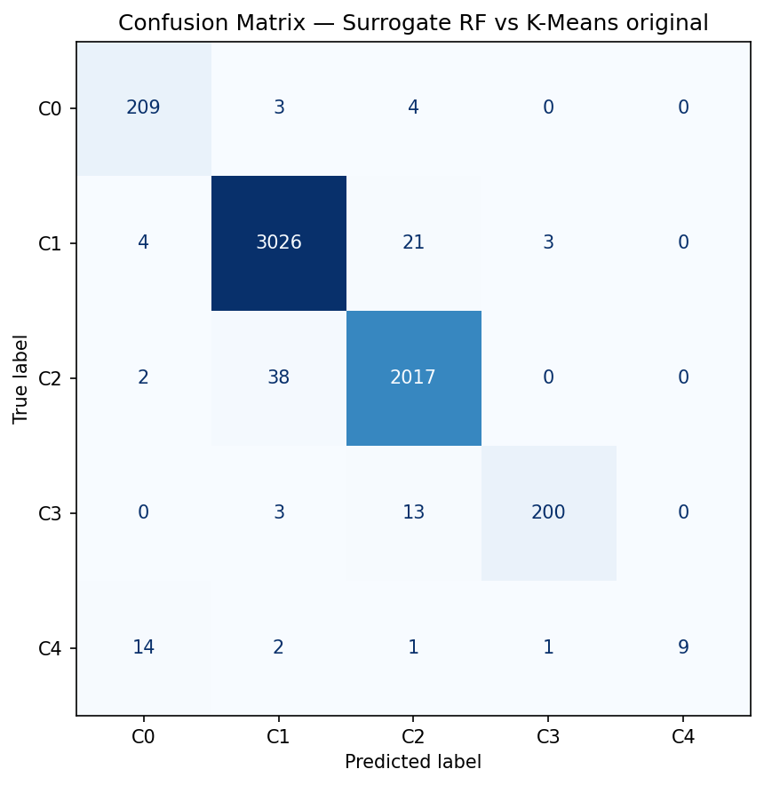

A matriz de confusão confirma que o surrogate reproduz a segmentação K-Means com alta fidelidade — garantindo que os valores SHAP explicam os clusters reais, não um proxy degradado.

---

## 4. Resultados

### 4.1 Cinco perfis de municípios

| Cluster | Municípios | Perfil |
|---------|:---:|--------|
| **C0 — Urbano-Avançado** | 216 (3,9%) | Alto PIB, alto IDHM, excelente upload — Sul/Sudeste |
| **C1 — Intermediário** | 3.054 (54,8%) | Desempenho médio nacional — padrão de referência |
| **C2 — Nordeste Periférico** | 2.057 (36,9%) | Infraestrutura existe, mas SLA fraco — Nordeste |
| **C3 — Norte/Amazônico** | 216 (3,9%) | Pior atendimento e resolução — municípios remotos |
| **C4 — Capitais/Destaques** | 27 (0,5%) | Benchmark nacional — 1 município por UF |

#### Perfil médio por cluster (z-scores)


O heatmap mostra os valores médios padronizados de cada cluster nos indicadores RQUAL e nas variáveis socioeconômicas. Valores positivos (verde) indicam desempenho acima da média nacional; negativos (vermelho), abaixo.

**Destaques:**
- **C3** apresenta IND4 = −1,70σ e IND5 = −2,09σ — os piores índices de atendimento e resolução do país
- **C4** lidera em densidade (+2,06σ), PIB industrial (+1,99σ) e IDHM (+1,63σ)
- **C0** se destaca em throughput de upload (+1,24σ) e velocidade de download (+0,54σ)

#### Comparação dos indicadores RQUAL por cluster


O radar evidencia a separação entre os clusters: C3 (vermelho) afunda em IND4 e IND5, enquanto C0 e C4 dominam em INF4-UP e IND9.

#### Distribuição geográfica


A segmentação reflete a estrutura regional do Brasil: **C0** é 67% Sudeste · **C2** é 84% Nordeste · **C3** é 68% Norte · **C4** distribui-se por todas as regiões.

#### Distribuição dos indicadores e cobertura por cluster


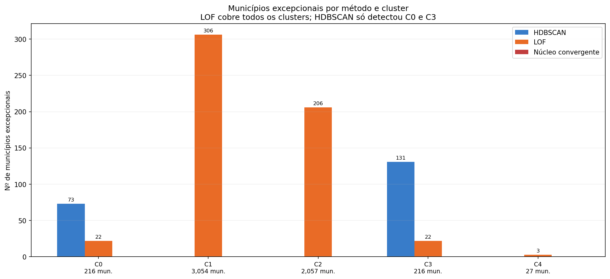

---

### 4.2 Validação estatística da segmentação

Para confirmar que a separação entre clusters não é artefato do algoritmo, aplicamos **ANOVA paramétrica** e **teste de Kruskal-Wallis** (não-paramétrico) sobre os 14 indicadores.

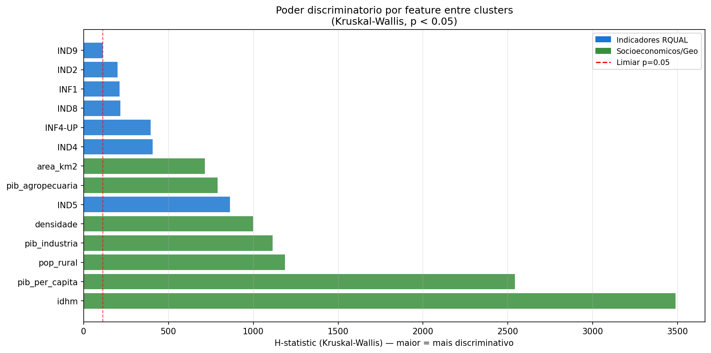

**Resultado:** todos os 14 indicadores apresentam p < 0,001 nos dois testes — a separação entre os 5 clusters é estatisticamente significativa em todas as dimensões. Os indicadores com maior poder discriminatório são `area_km2`, `lat`, `idhm` e `IND5` — alinhando-se com os achados SHAP (seção 5.3).

---

### 4.3 Projeção UMAP

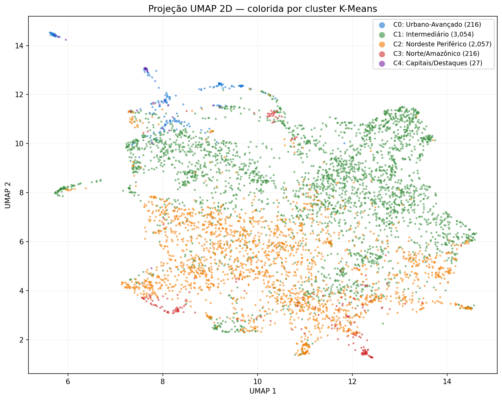

A projeção UMAP em 2D ilustra a estrutura de separação aprendida pelo K-Means no espaço de 20 features. C3 e C4 formam ilhas compactas; C1 e C2 ocupam regiões contíguas com fronteira suave; C0 aparece como satélite de C4 — consistente com o achado SHAP de que ambos são movidos pelas mesmas features (`pib_industria`, `densidade`).

---

## 5. Discussão dos Resultados

### 5.1 Sub-estruturas internas — HDBSCAN

O HDBSCAN revelou sub-estruturas densas em C0 e C3: **204 municípios (3,7%)** formaram 4 sub-clusters com alto valor analítico — municípios similares entre si que divergem do padrão geral do cluster pai.

#### C3 — Norte/Amazônico: dois padrões opostos dentro do pior cluster


| Grupo | Mun. | IND4 | IND5 | Perfil |
|-------|:---:|:---:|:---:|--------|
| **Ruído** | 85 | −1,77 | −2,28 | Caso mais crítico — sem conectividade nem qualidade operacional |
| **Sub-0 — Amazônia profunda** | 112 | −1,81 | −2,19 | PA, AM, AC, RR — atendimento crítico, mas IND9 acima da média (+0,14) |
| **Sub-1 — Agronegócio MT/MS** | 19 | −0,76 | −0,59 | **Exceção positiva** — remotos e rurais, mas qualidade muito superior |

**Sub-cluster Agronegócio MT/MS:** 19 municípios de MT (15), MS (3) e MG (1) — Tangará da Serra, Campo Novo do Parecis, Canarana, Cáceres, Juína. Apesar de serem extensos, rurais e classificados no "pior cluster" pelo K-Means, a dinâmica do agronegócio viabilizou qualidade radicalmente superior: IND5 salta de −2,19σ para −0,59σ. São a prova de que o contexto geográfico não é impeditivo quando há investimento.

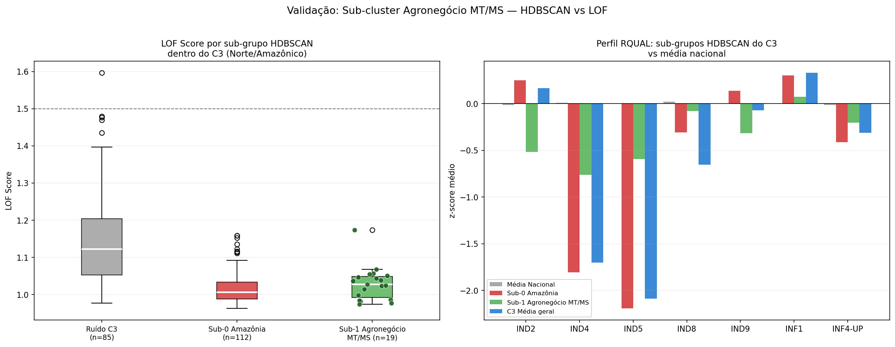

#### C0 — Urbano-Avançado: dois tipos de excelência


| Grupo | Mun. | IND4 | INF4-UP | Perfil |
|-------|:---:|:---:|:---:|--------|
| **Sub-0 — Elite total** | 50 | −0,12 | +1,51 | SP (28), MG, RJ — topo absoluto em todos os indicadores |
| **Sub-1 — Gargalo de atendimento** | 23 | **−0,37** | +1,36 | SP (11), RJ (6) — alta velocidade, mas atendimento sobrecarregado |

**Sub-cluster Gargalo metrópoles:** infraestrutura de ponta (INF4-UP +1,36σ, IND9 +0,70σ) mas IND4 negativo — o volume de chamados nas grandes metrópoles supera a capacidade das operadoras. Fenômeno de saturação operacional, não técnica.

---

### 5.2 Municípios excepcionais — LOF

O LOF identificou **559 municípios excepcionais** (10% por cluster) com combinações atípicas de indicadores, cobrindo todos os 5 clusters — incluindo C1 e C2, que eram analiticamente opacos ao HDBSCAN.

> **LOF score > 1,5** como limiar de alta excentricidade. Score máximo observado: **2,266** (Águas de São Pedro/SP).

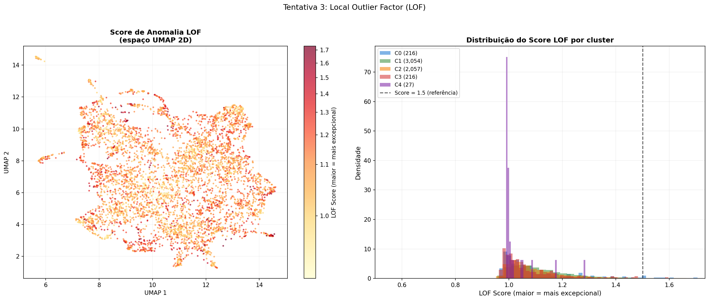

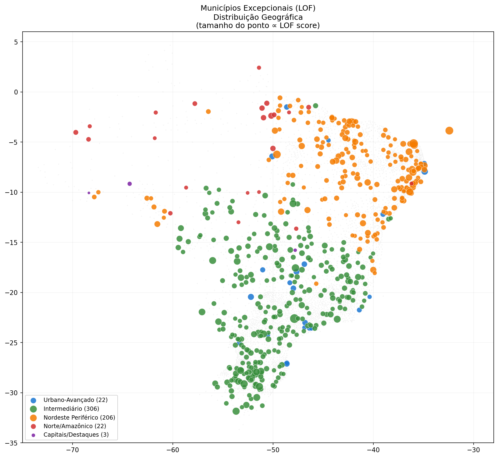

#### C1 — Intermediário: 306 excepcionais

O maior cluster concentra os maiores extremos individuais do país — municípios normais na maioria dos indicadores, mas com um ou dois em valores impossíveis para o contexto.

| Município | UF | LOF | Padrão atípico |
|-----------|:---:|:---:|----------------|
| **Águas de São Pedro** | SP | 2,27 | Alta velocidade (+1,12σ) com cobertura fraca — acesso premium em estância balneária |
| **Tunas** | RS | 1,88 | IND4 = −4,06σ e IND5 = −4,31σ — colapso de atendimento |
| **Silvanópolis** | TO | 1,82 | Pior IND9 do cluster (−4,11σ) com cobertura acima da média |
| **São Vendelino** | RS | 1,89 | IND2 = +4,28σ — caso extremo de insatisfação |
| **Camargo** | RS | 1,99 | Upload excepcional (+3,10σ) — desvio positivo isolado |

#### C2 — Nordeste Periférico: 206 excepcionais

| Município | UF | LOF | Padrão atípico |
|-----------|:---:|:---:|----------------|
| **São Bento do Norte** | RN | 2,23 | Alta IND4 com IND5 negativo — atende mas não resolve |
| **Fernando de Noronha** | PE | 2,01 | IND4 = IND5 = −4,33σ — isolamento geográfico extremo |
| **Curionópolis** | PA | 1,98 | IND8 = −4,16σ — único no C2 com disponibilidade crítica |
| **Arapiraca** | AL | 1,84 | Upload elevado (+1,71σ) — contrasta com o perfil típico do Nordeste |

#### C4 — Capitais/Destaques: 3 excepcionais

| Município | UF | LOF | Padrão atípico |
|-----------|:---:|:---:|----------------|
| **Porto Velho** | RO | 1,29 | Upload elevado, IND5 levemente negativo — capital amazônica fora do perfil |
| **Brasília** | DF | 1,18 | Upload excepcionalmente alto (+1,31σ) — concentração de infraestrutura federal |
| **Rio Branco** | AC | 1,09 | Maior upload do C4 (+2,20σ) — investimento desproporcional |

As 3 capitais excepcionais são amazônicas — perfil de upload elevado combinado com SLA levemente abaixo do esperado para o cluster.

---

### 5.3 Explicabilidade por cluster — SHAP

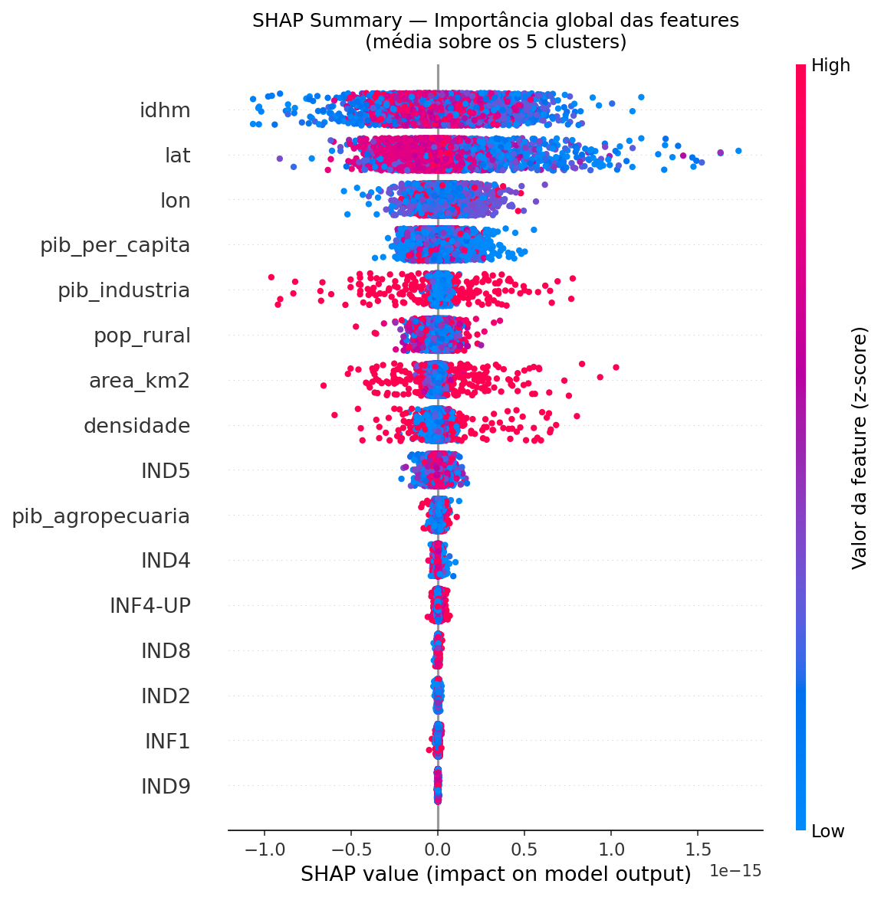

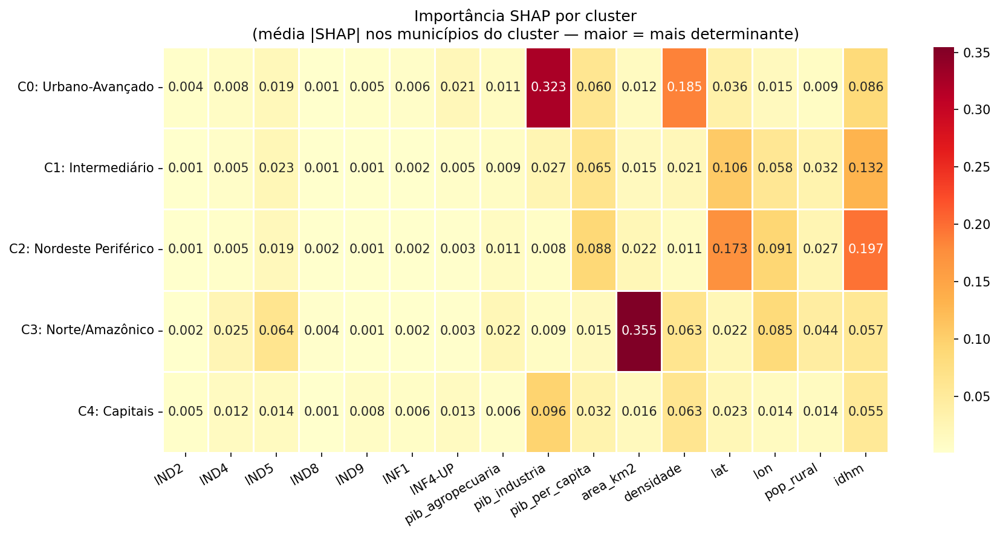

#### O que realmente define cada cluster

| Cluster | Feature dominante | \|SHAP\| | O que isso revela |
|---------|---|:---:|---|
| **C0 — Urbano-Avançado** | `pib_industria` | 0,323 | PIB industrial — não qualidade RQUAL — define a elite |
| **C1 — Intermediário** | `idhm` + `lat` | 0,132 | Desenvolvimento humano + posição geográfica (Sul/Sudeste) |
| **C2 — Nordeste Periférico** | `idhm` + `lat` + `lon` | 0,197 | **A localização geográfica explica o cluster melhor que os indicadores de telecom** |
| **C3 — Norte/Amazônico** | `area_km2` | **0,355** | A extensão territorial domina — classificado pelo tamanho antes da qualidade do serviço |
| **C4 — Capitais** | `pib_industria` + `densidade` | 0,096 | Mesmas features do C0, em escala urbana máxima |

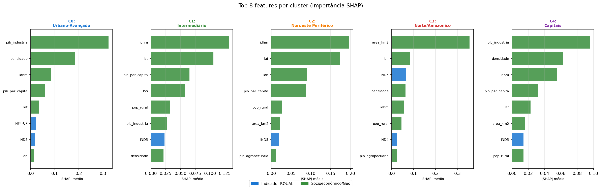

#### Três achados que mudam a interpretação regulatória

**1. C3 é criado pela geografia, não pelo serviço**

`area_km2` tem |SHAP| = 0,355 — mais que o dobro do segundo lugar em qualquer cluster. Municípios norte-amazônicos são agrupados por sua imensidão territorial *antes* dos indicadores de qualidade. A má qualidade de telecom no C3 é *consequência* do contexto geográfico, não causa da classificação. A política regulatória deve atacar a barreira territorial, não apenas o indicador de SLA.

**2. C2 é definido pela localização, não pelo IDHM isolado**

`lat` e `lon` somam |SHAP| = 0,264 no C2 — o Nordeste é tão geograficamente coeso que as coordenadas identificam o cluster quase tão bem quanto os indicadores socioeconômicos. Isso confirma que a qualidade operacional inferior do C2 tem raízes estruturalmente regionais.

**3. C0 e C4 são movidos pelo mesmo motor**

`pib_industria` domina em ambos os clusters de alta performance. A distinção entre "municípios avançados" e "capitais" é de escala, não de natureza — capitais têm mais do mesmo que os melhores municípios não-capitais.

#### Waterfall — explicações individuais

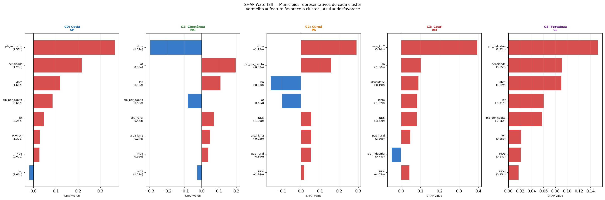

Os gráficos waterfall mostram, para municípios representativos de cada cluster, quais features contribuíram positiva ou negativamente para a classificação. Cada município tem sua explicação individual registrada em `shap_explicacoes_municipios.csv`.

#### SHAP nos municípios excepcionais LOF

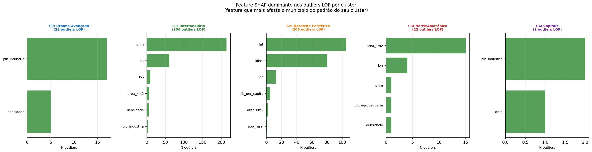

Os municípios excepcionais tendem a ter uma **feature com valor SHAP desproporcional** em relação ao restante do cluster — confirmando que sua excentricidade é direcionada, não ruído aleatório. Fernando de Noronha, por exemplo, é dominado por `lon` e `IND4` em direções opostas ao perfil do C2.

---

### 5.4 Ortogonalidade entre HDBSCAN e LOF

> **Sobreposição HDBSCAN ∩ LOF: 0 municípios** — resultado esperado e revelador.

| Tipo de excepcionalidade | Método | O que detecta |
|---|---|---|
| **Exceção de grupo** | HDBSCAN | Municípios similares entre si que formam sub-grupo coeso distinto do cluster pai |
| **Exceção individual** | LOF | Município isolado, sem vizinhança densa — anomalia pontual |

Os métodos medem **dimensões ortogonais** da excepcionalidade: um município em sub-cluster HDBSCAN tem LOF score baixo (está rodeado de similares). Um outlier LOF não forma sub-cluster (está isolado, sem grupo coeso). **Confirmação estatística:** Mann-Whitney U — municípios HDBSCAN têm LOF score significativamente menor (p < 0,001).

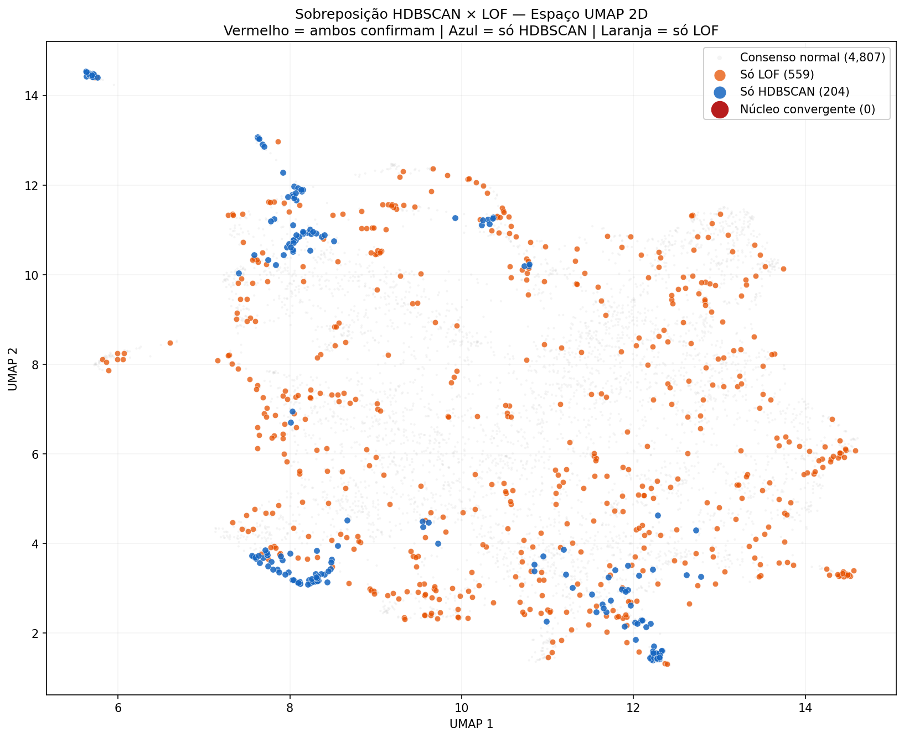

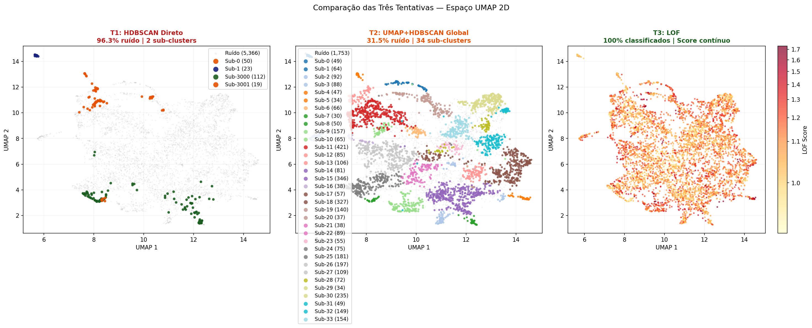

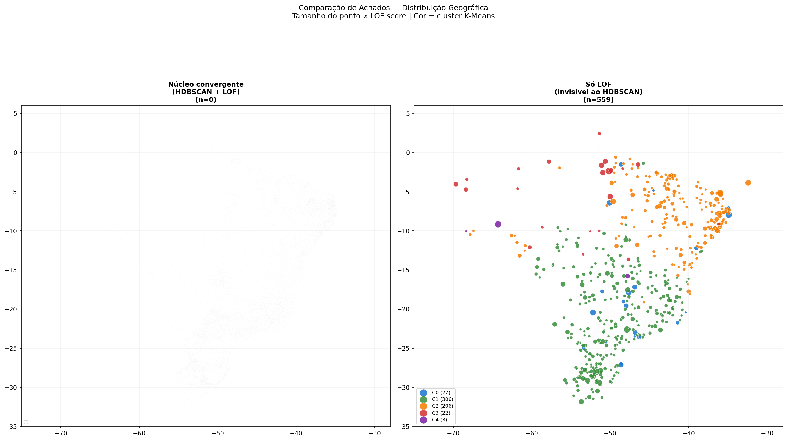

> **763 municípios excepcionais** na união: 204 por coesão de grupo (HDBSCAN) + 559 por isolamento individual (LOF).  
> Exportados com tipo de excepcionalidade em `comparacao_achados_hdbscan_lof.csv`.

---

### 5.5 Visão Consolidada por Cluster

Síntese 360° integrando segmentação, explicabilidade (SHAP) e municípios excepcionais:

| Cluster | N (%) | Features SHAP dominantes | Outliers LOF | Sub-grupos HDBSCAN | Prioridade regulatória |
|---|:---:|---|:---:|---|:---:|
| **C0 Urbano-Avançado** | 216 (3,9%) | `pib_industria`, `densidade`, `idhm` | 22 | 2 (elite total + gargalo SP/RJ) | Manutenção |
| **C1 Intermediário** | 3.054 (54,8%) | `idhm`, `lat`, `pib_per_capita` | 306 | — | Monitoramento |
| **C2 Nordeste Periférico** | 2.057 (36,9%) | `idhm`, `lat`, `lon` | 206 | — | Alta |
| **C3 Norte/Amazônico** | 216 (3,9%) | `area_km2`, `lon`, `IND5` | 22 | 2 (Amazônia profunda + Agronegócio MT/MS) | Crítica |
| **C4 Capitais** | 27 (0,5%) | `pib_industria`, `densidade`, `idhm` | 3 | — | Benchmark |

---

## 6. Implicações para Políticas Públicas

Os resultados apontam para intervenções regulatórias distintas por perfil — não por indicador isolado. A chave da contribuição analítica deste framework é que os drivers de cada cluster, revelados pelo SHAP, orientam *onde* e *como* intervir.

### C3 — Norte/Amazônico: atacar a barreira territorial, não o SLA

O SHAP confirma que `area_km2` domina a classificação (|SHAP|=0,355). Esses municípios não chegam ao C3 por má gestão operacional, mas por isolamento estrutural. Políticas de cobertura (satélite, roteamento alternativo, subsídio de infraestrutura) têm mais impacto do que metas de SLA aplicadas a operadoras sem infraestrutura viável. O sub-cluster do Agronegócio MT/MS é a prova empírica: condições geográficas similares, mas investimento privado viabilizou qualidade radicalmente superior (IND5 salta de −2,19σ para −0,59σ).

### C2 — Nordeste Periférico: maturidade operacional, não expansão de rede

A rede existe (INF1 acima da média). O problema é operacional: IND5 (resolução no prazo) e IND2 (reclamações) são os indicadores mais negativos. Políticas de SLA rigoroso e incentivos à eficiência de atendimento são mais eficientes do que novas licenças de cobertura. O SHAP revela que `lat`/`lon` explicam tanto quanto o IDHM — confirmando que a fragilidade tem raízes estruturalmente regionais que transcendem qualquer operadora individual.

### C1 — Intermediário: vigilância nos extremos individuais

O LOF revela 306 exceções individuais no maior cluster — municípios que parecem normais em média, mas têm um indicador em colapso (Tunas/RS: IND5 = −4,31σ). Monitoramento automatizado via LOF score permite identificação precoce antes que o problema se consolide como padrão.

### C0 / C4 — Benchmark: replicabilidade como política

Os dois clusters de alta performance têm o mesmo motor (PIB industrial + densidade). O sub-cluster de gargalo do C0 — municípios SP/RJ com IND4 negativo apesar de infraestrutura de ponta — mostra que mesmo a elite pode saturar operacionalmente. Políticas de capacidade de atendimento (não técnica) são o instrumento correto aqui.

---

## 7. Reprodutibilidade

### Pipeline detalhado

#### Notebook 01 — Leitura e Unificação RQUAL
`0-Fonte de Dados/RQUAL/XLSX/01-Leitura e união de todos os estados.ipynb`

**Entrada:** 12 arquivos XLSX por agrupamento de estados  
**Saída:** `base_RQUAL_unificada.parquet` — **5.962.723 linhas × 19 colunas**

- Leitura paralela com `ThreadPoolExecutor` (8 workers) — engine `calamine` (~3× mais rápido que `openpyxl` em arquivos grandes)
- Coluna `__arquivo_origem` para rastreabilidade por estado
- Cobertura: 2022–2025, 8 indicadores, todas as UFs

---

#### Notebook 02 — Preparação do Ano Base
`0-Fonte de Dados/RQUAL/XLSX/02-Análise, Seleção e Preparação de ano base.ipynb`

**Entrada:** `base_RQUAL_unificada.parquet`  
**Saída:** `rqual_2022_consolidado_clean.parquet` — **5.570 linhas × 11 colunas**

- Filtro para 2022 — único ano com cobertura completa dos 8 indicadores para a maioria dos municípios
- Agregação municipal: média anual por indicador
- Imputação por mediana da UF (fallback: mediana nacional)
- Logs: `rqual_2022_log_imputacao.csv`, `auditoria_imputacao_resumo.csv`

---

#### Notebook 03 — Agregação IBGE
`0-Fonte de Dados/IBGE/RAW/03-Agregacao_Dados_Socio-Economicos1_PATCHED.ipynb`

**Entrada:** 5 fontes IBGE independentes (PIB, população/área, urbanização, IDHM, lat/lon)  
**Saída:** `base_socioeconomica_completa.xlsx` — **5.570 municípios × 56 colunas**

- Merge progressivo por `cod_mun`
- Normalização Unicode NFKD para joins robustos (remove acentos sem truncar nomes)
- Coordenadas corrigidas: fonte IBGE armazena lat/lon como inteiros ×10.000 (e.g. −167573 → −16,7573°); divisão aplicada com assertivas de validação

---

#### Notebook 04 — Integração RQUAL + IBGE
`1-Base Integrada - RQUAL+SocioEconomicos/04-Integracao e Analise de Variaveis RQUAL+SocioEc.ipynb`

**Entrada:** RQUAL 2022 (5.570 × 11) + IBGE (5.570 × 56)  
**Saída:** `rqual_2022_integrado.parquet` — **5.570 linhas × 78 colunas**

- Join left por `cod_mun` — todos os 5.570 municípios preservados
- Zero municípios sem dados socioeconômicos após merge

---

#### Notebook 05 — Feature Selection
`2-FeatureSelection/05-Seleção de feicoes.ipynb`

**Entrada:** `rqual_2022_integrado.parquet` (5.570 × 78)  
**Saída:** `rqual_2022_feats_reduzidas.parquet` — **5.570 linhas × 20 features**

Logs: `log_poda_correlacao.csv`, `log_vif_iterativo.csv`, `log_zscore_validacao_completo.csv`, `log_imputacao_socio.csv`, `log_robustez_transformacoes.csv`

---

#### Notebook 06 — Clustering K-Means + HDBSCAN
`3-KMeans+HDBSCAN/06-Kmeans.ipynb`

**Entrada:** `rqual_2022_feats_reduzidas.parquet`  
**Saída:** `rqual_2022_clusterizado.parquet`

Artefatos: `kmeans_model.pkl`, `scaler_final.pkl`, `kmeans_metricas_por_K.csv`, `kmeans_escolha_config.json`

---

#### Notebook 07 — Interpretação dos Clusters
`3-KMeans+HDBSCAN/07-Interpretacao_Clusters.ipynb`

**Saída:** heatmap · radar · mapa geográfico · distribuição regional · boxplots · ANOVA/Kruskal-Wallis · `tabela_resumo_clusters.csv`

---

#### Notebook 08 — UMAP + HDBSCAN vs LOF
`3-KMeans+HDBSCAN/08-UMAP_HDBSCAN_LOF.ipynb`

**Saída:** `rqual_2022_clusterizado_v2.parquet` (com `umap_x`, `umap_y`, `lof_score`, `lof_outlier`) + `municipios_excepcionais_lof.csv`

---

#### Notebook 09 — Comparação HDBSCAN vs LOF
`3-KMeans+HDBSCAN/09-Comparacao_Achados_HDBSCAN_vs_LOF.ipynb`

**Saída:** `comparacao_achados_hdbscan_lof.csv` — **763 municípios excepcionais (HDBSCAN ∪ LOF)** com tipo de excepcionalidade

---

#### Notebook 10 — SHAP: Explicabilidade por Cluster
`3-KMeans+HDBSCAN/10-SHAP_Explicabilidade_Clusters.ipynb`

**Saída:** `shap_importancia_por_cluster.csv` · `shap_explicacoes_municipios.csv` · `shap_matrix_completa.csv`

---

### Instalação

```bash
git clone https://github.com/mfidosjr/Framework-Explicabilidade-Indicadores.git
cd Framework-Explicabilidade-Indicadores
pip install -r requirements.txt
```

> Alguns arquivos XLSX de dados brutos (50–80 MB) são armazenados diretamente no repositório. Para arquivos maiores, use `git lfs pull`.

---

### Artefatos principais

| Arquivo | Localização | Descrição |
|---------|------------|-----------|
| `base_RQUAL_unificada.parquet` | `0-Fonte de Dados/RQUAL/XLSX/` | RQUAL nacional (5,96M × 19) |
| `rqual_2022_consolidado_clean.parquet` | `0-Fonte de Dados/RQUAL/XLSX/` | RQUAL 2022 agregado por município |
| `rqual_2022_integrado.parquet` | `2-FeatureSelection/` | Base integrada RQUAL+IBGE (5.570 × 78) |
| `rqual_2022_feats_reduzidas.parquet` | `2-FeatureSelection/` | 20 features selecionadas para clustering |
| `rqual_2022_clusterizado.parquet` | `3-KMeans+HDBSCAN/` | K-Means K=5 + HDBSCAN local (v1) |
| `rqual_2022_clusterizado_v2.parquet` | `3-KMeans+HDBSCAN/` | Base enriquecida com UMAP coords + LOF score |
| `municipios_excepcionais_lof.csv` | `3-KMeans+HDBSCAN/` | 559 municípios excepcionais (LOF, 10% por cluster) |
| `comparacao_achados_hdbscan_lof.csv` | `3-KMeans+HDBSCAN/` | 763 municípios excepcionais (HDBSCAN ∪ LOF, com tipo) |
| `kmeans_model.pkl` | `3-KMeans+HDBSCAN/` | Modelo K-Means treinado (K=5) |
| `scaler_final.pkl` | `3-KMeans+HDBSCAN/` | RobustScaler ajustado |
| `kmeans_metricas_por_K.csv` | `3-KMeans+HDBSCAN/` | Métricas de avaliação K=2 a K=12 |
| `tabela_resumo_clusters.csv` | `3-KMeans+HDBSCAN/` | Perfil médio por cluster |
| `shap_importancia_por_cluster.csv` | `3-KMeans+HDBSCAN/` | Importância SHAP feature × cluster (16 × 5) |
| `shap_explicacoes_municipios.csv` | `3-KMeans+HDBSCAN/` | Feature dominante + \|SHAP\| de cada município (5.570 linhas) |
| `shap_matrix_completa.csv` | `3-KMeans+HDBSCAN/` | Matriz completa de valores SHAP (5.570 × 16) |

---

### Módulos Python (`src/`)

| Módulo | Funções principais |
|--------|-------------------|
| `data_loader.py` | `load_rqual_parallel()`, `load_ibge_socioeconomico()`, `load_parquet()` |
| `feature_engineering.py` | `impute_by_uf()`, `remove_high_correlation()`, `run_vif_iterative()`, `validate_zscore()` |
| `clustering.py` | `evaluate_kmeans_range()`, `choose_best_k()`, `run_hdbscan_per_cluster()`, `save_clustering_artifacts()` |

---

### Documentação técnica

- `Documentacao/RQUALCDUST10112022.pdf` — Manual técnico RQUAL (Anatel)
- `Documentacao/Glossario_de_Termos_Indicadores de Qualidade dos Serviços RQUAL_V2.odt` — Glossário de termos

---

### Tecnologias

- Python 3.10+ · pandas · numpy · scipy
- scikit-learn · hdbscan · umap-learn · shap
- pyarrow · openpyxl · python-calamine
- matplotlib · seaborn · geobr
- Jupyter Notebooks
