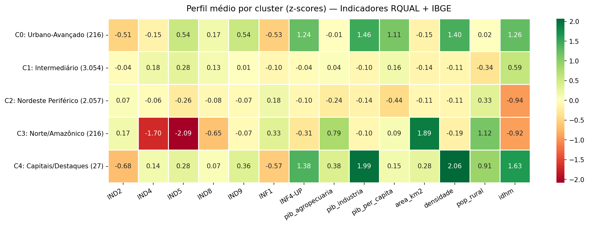
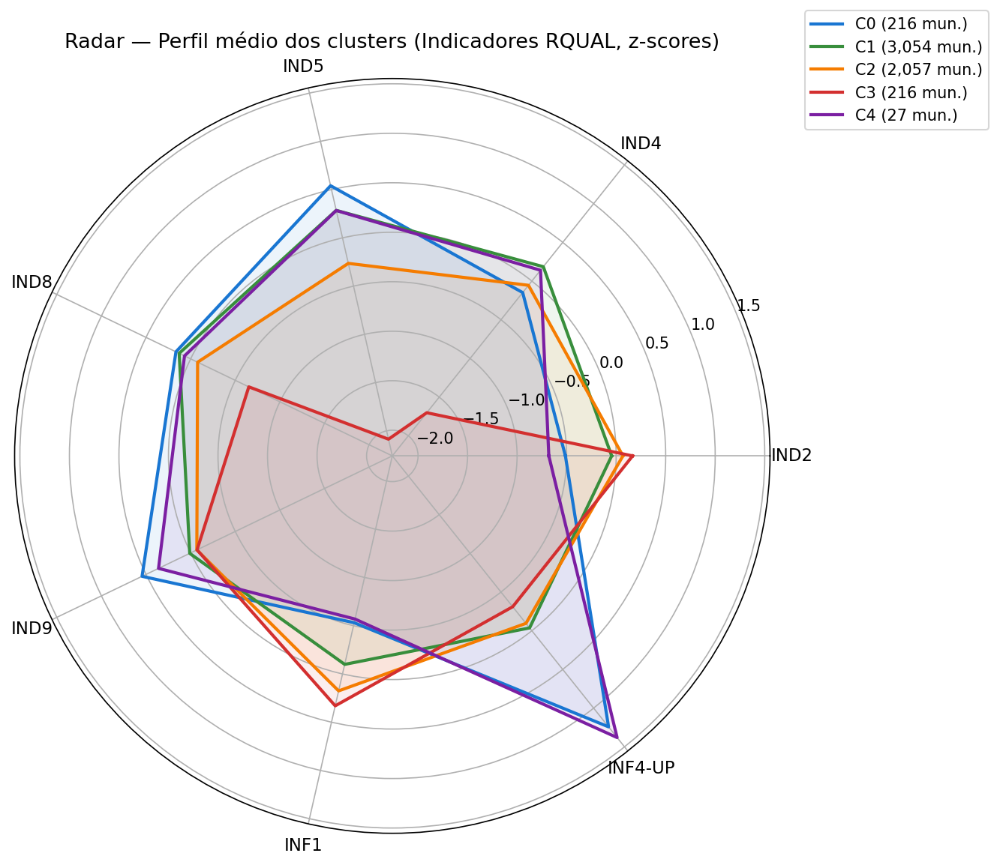
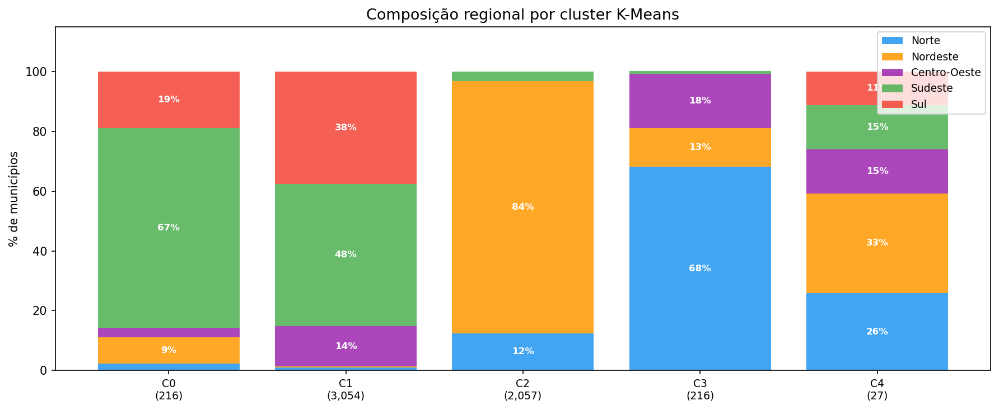
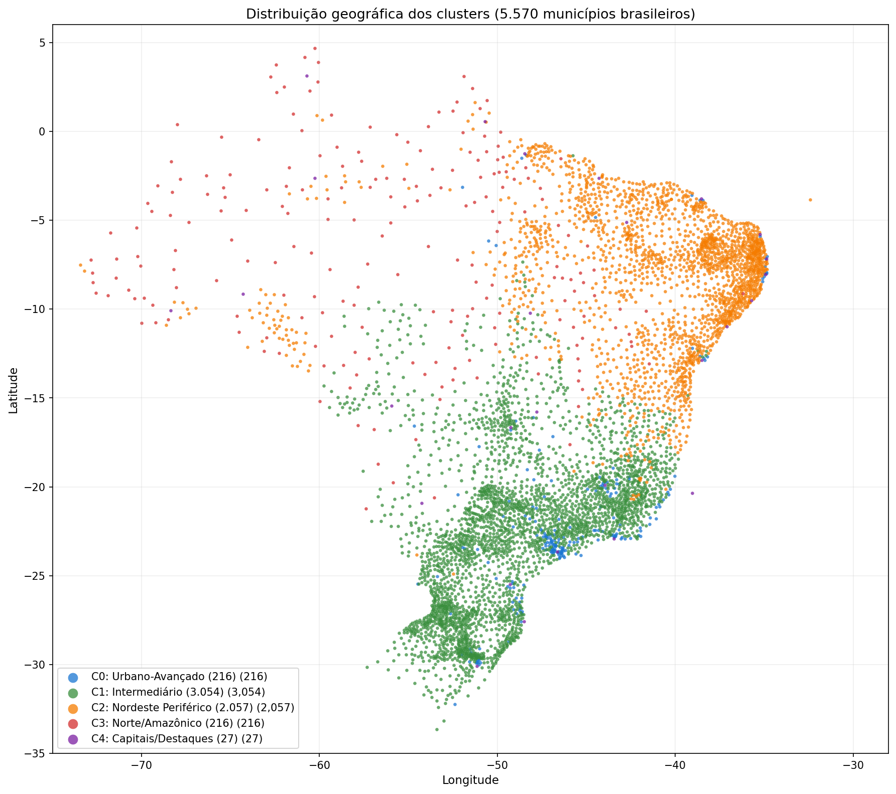
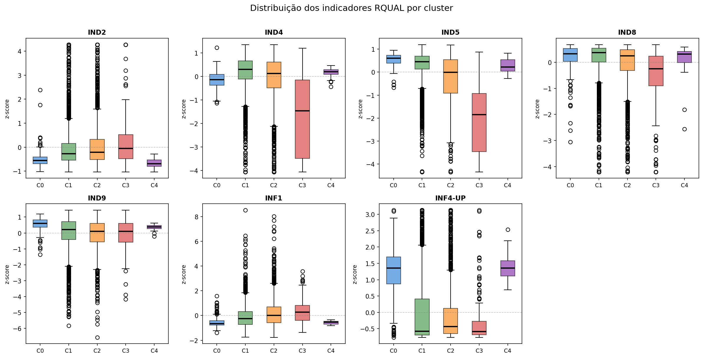
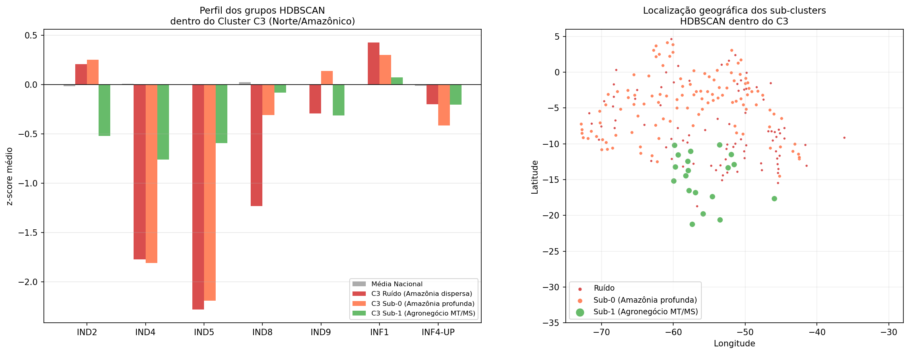
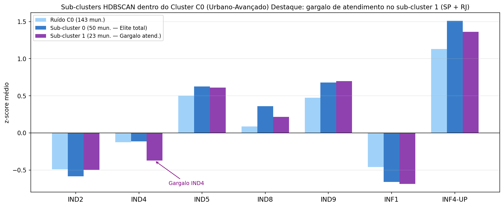

# Framework de Explicabilidade de Indicadores de Qualidade de Telecomunicações

Framework analítico para segmentação e explicabilidade de municípios brasileiros com base em indicadores de qualidade de serviços de telecomunicações (RQUAL/Anatel) cruzados com dados socioeconômicos e geográficos do IBGE.

## Objetivo

Identificar padrões e agrupamentos entre os **5.570 municípios brasileiros** combinando:
- **Indicadores RQUAL** (Anatel): 8 indicadores de qualidade de telecomunicações
- **Dados IBGE**: PIB, população, densidade, urbanização, IDHM, coordenadas geográficas

O resultado é uma segmentação hierárquica (K-Means → HDBSCAN) que permite interpretar o contexto socioeconômico e territorial associado à qualidade do serviço em cada município, subsidiando políticas regulatórias e priorização de investimentos.

---

## Resultados: 5 perfis de municípios

O modelo identificou **5 clusters** com características distintas de qualidade e contexto socioeconômico:

| Cluster | Municípios | Perfil |
|---------|-----------|--------|
| **C0 — Urbano-Avançado** | 216 (3,9%) | Alto PIB, alto IDHM, excelente upload — Sul/Sudeste |
| **C1 — Intermediário** | 3.054 (54,8%) | Desempenho médio nacional — padrão de referência |
| **C2 — Nordeste Periférico** | 2.057 (36,9%) | Infraestrutura existe, mas SLA fraco — Nordeste |
| **C3 — Norte/Amazônico** | 216 (3,9%) | Pior atendimento e resolução — municípios remotos |
| **C4 — Capitais/Destaques** | 27 (0,5%) | Benchmark nacional — 1 município por UF |

### Perfil médio por cluster (z-scores)



O heatmap mostra os valores médios padronizados (z-score) de cada cluster nos indicadores RQUAL e nas variáveis socioeconômicas do IBGE. Valores positivos (verde) indicam desempenho acima da média nacional; negativos (vermelho), abaixo.

**Destaques:**
- **C3 (Norte/Amazônico)** apresenta IND4 = −1,70σ e IND5 = −2,09σ — os piores índices de atendimento e resolução de todo o país
- **C4 (Capitais)** lidera em densidade demográfica (+2,06σ), PIB industrial (+1,99σ) e IDHM (+1,63σ)
- **C0 (Urbano-Avançado)** se destaca em throughput de upload (+1,24σ) e velocidade de download (+0,54σ)

---

### Comparação dos indicadores RQUAL por cluster



O radar evidencia a separação entre os clusters: C3 (vermelho) afunda em IND4 e IND5, enquanto C0 e C4 (azul e roxo) dominam em INF4-UP e IND9.

---

### Composição regional e distribuição geográfica





A segmentação reflete fortemente a estrutura regional do Brasil:
- **C0** é 67% Sudeste | **C1** é 48% Sudeste + 38% Sul
- **C2** é 84% Nordeste | **C3** é 68% Norte
- **C4** distribui-se por todas as regiões (1 capital por UF)

---

### Distribuição dos indicadores por cluster



---

## Interpretação dos clusters

### C0 — Urbano-Avançado (216 municípios)
Municípios com maior desenvolvimento socioeconômico e melhor infraestrutura de telecom. Concentrados em SP (81), MG (30), RJ (25), RS (15) e PR (13). A qualidade do serviço acompanha o nível de renda e urbanização: alta taxa de resolução no prazo, poucas reclamações e throughput de upload excepcionalmente elevado.

### C1 — Intermediário (3.054 municípios)
O cluster da "maioria silenciosa" — municípios com serviços adequados, sem problemas críticos. Representa o padrão de referência para políticas de manutenção de qualidade. Dominado por MG (754), SP (563), RS (481), PR (384) e SC (281).

### C2 — Nordeste Periférico (2.057 municípios)
A infraestrutura chegou (INF1 acima da média), mas a qualidade operacional é inferior: taxa de resolução de problemas no prazo (IND5) abaixo da média e mais reclamações (IND2). Reflete o desafio de expansão sem maturidade operacional. PIB per capita (−0,44σ) e IDHM (−0,94σ) significativamente abaixo da média.

### C3 — Norte/Amazônico (216 municípios)
Municípios de **alta vulnerabilidade**. Área territorial imenso (+1,89σ), população rural (+1,12σ) e economia primária (+0,79σ no VAB agropecuário) criam barreiras severas. IND5 = −2,09σ e IND4 = −1,70σ: os piores do país. **Prioridade máxima para políticas regulatórias.**

### C4 — Capitais/Destaques (27 municípios)
Exatamente 1 município por UF — as capitais estaduais. Benchmark de qualidade: maior densidade (+2,06σ), maior upload (+1,38σ) e menor taxa de reclamações (−0,68σ). Referência do que é tecnicamente possível com investimento e densidade econômica adequados.

---

## Achados HDBSCAN — Sub-estruturas dentro dos clusters

O HDBSCAN foi aplicado dentro de cada macro-cluster K-Means para revelar **exceções e subestruturas de densidade local**: municípios que fogem do padrão do seu próprio cluster — seja para melhor ou para pior. Esses são os achados mais acionáveis do framework.

> Dos 5.570 municípios, **204 (3,7%)** formaram sub-clusters densos. Os demais foram classificados como *ruído* — casos intermediários sem vizinhança suficientemente densa.

### C3 Norte/Amazônico — dois sub-clusters revelam padrões opostos



O cluster de pior qualidade do país esconde duas realidades distintas:

| Grupo | Mun. | IND4 | IND5 | Perfil |
|-------|------|------|------|--------|
| **Ruído** | 85 | −1,77 | −2,28 | Pior de todos — sem conectividade nem qualidade operacional |
| **Sub-0 — Amazônia profunda** | 112 | −1,81 | −2,19 | PA, AM, AC, RR — atendimento crítico, mas IND9 acima da média (+0,14) |
| **Sub-1 — Agronegócio MT/MS** | 19 | −0,76 | −0,59 | **Exceção positiva** — remotos e rurais, mas com qualidade muito superior |

**Destaque — Sub-cluster 3001 (Agronegócio MT/MS):** 19 municípios de Mato Grosso (15), Mato Grosso do Sul (3) e Minas Gerais (1) — Tangará da Serra, Campo Novo do Parecis, Canarana, Cáceres, Juína, entre outros. Apesar de serem municípios extensos e rurais com economia agropecuária (classificados como "Norte/Amazônico" pelo K-Means), a dinâmica econômica do agronegócio viabilizou qualidade de telecom muito acima dos vizinhos: IND5 salta de −2,19σ para −0,59σ. **São a prova de que o contexto geográfico não é impeditivo quando há investimento.**

---

### C0 Urbano-Avançado — dois tipos de excelência



Dentro do melhor cluster, o HDBSCAN separou dois grupos distintos de alta performance:

| Grupo | Mun. | IND4 | INF4-UP | Perfil |
|-------|------|------|---------|--------|
| **Sub-0 — Elite total** | 50 | −0,12 | +1,51 | SP (28), MG, RJ — topo absoluto em todos os indicadores |
| **Sub-1 — Gargalo de atendimento** | 23 | **−0,37** | +1,36 | SP (11), RJ (6) — alta velocidade, mas atendimento sobrecarregado |

**Destaque — Sub-cluster 1 (Gargalo metrópoles):** municípios de SP e RJ com infraestrutura de ponta (INF4-UP +1,36σ, IND9 +0,70σ) mas IND4 negativo — a taxa de atendimento cai porque o volume de chamados nas grandes metrópoles supera a capacidade das operadoras. Fenômeno de saturação operacional, não técnica.

---

### Síntese dos achados HDBSCAN

| Sub-cluster | Municípios | Insight chave |
|-------------|-----------|--------------|
| C3 Sub-1 — Agronegócio MT/MS | 19 | Exceção **positiva** no pior cluster: remotos, rurais, mas com boa qualidade |
| C3 Sub-0 — Amazônia profunda | 112 | Péssimo atendimento/prazo, mas velocidade razoável (possivelmente satelital) |
| C3 Ruído | 85 | Caso mais crítico: nem conectividade nem qualidade operacional |
| C0 Sub-0 — Elite total | 50 | Benchmark máximo nacional em todos os indicadores |
| C0 Sub-1 — Gargalo metrópoles | 23 | Qualidade técnica alta, mas saturação de atendimento em SP e RJ |
| C1, C2, C4 | — | Sem sub-estruturas densas (grupos homogêneos, dispersos ou pequenos) |

---

## Implicações para políticas públicas

| Eixo | Clusters-alvo | Problema | Indicadores-alvo |
|------|--------------|----------|-----------------|
| **Expansão de Qualidade** | C3 — Norte/Amazônico | SLA crítico em municípios remotos | IND4, IND5 |
| **Maturidade Operacional** | C2 — Nordeste | Rede existe, atendimento falha | IND5, IND2 |
| **Manutenção e Benchmark** | C0, C4 | Replicar boas práticas | INF4-UP, IND8 |

---

## Pipeline — O que foi feito em cada etapa

### Notebook 01 — Leitura e Unificação RQUAL
`0-Fonte de Dados/RQUAL/XLSX/01-Leitura e união de todos os estados.ipynb`

**Entrada:** 12 arquivos XLSX por agrupamento de estados (ex: RQUAL_8ind-SP.xlsx, RQUAL_8ind-MG.xlsx...)  
**Saída:** `base_RQUAL_unificada.parquet` — **5.962.723 linhas × 19 colunas**

**O que foi feito:**
- Leitura paralela com `ThreadPoolExecutor` (8 workers) — engine `calamine` preferido sobre `openpyxl` por performance
- Adição de coluna `__arquivo_origem` para rastreabilidade por estado
- Validação de duplicatas (zero encontradas)
- Cobertura: anos 2022, 2023, 2024 e 2025; 8 indicadores; todas as UFs

**Decisões metodológicas:** engine calamine reduz tempo de leitura ~3x vs openpyxl em arquivos grandes; leitura paralela em ~50s num Mac M4 vs ~4min sequencial.

---

### Notebook 02 — Preparação do Ano Base
`0-Fonte de Dados/RQUAL/XLSX/02-Análise, Seleção e Preparação de ano base.ipynb`

**Entrada:** `base_RQUAL_unificada.parquet` (5,96M linhas)  
**Saída:** `rqual_2022_consolidado_clean.parquet` — **5.570 linhas × 11 colunas** (1 linha por município)

**O que foi feito:**
- Filtro para ano base 2022 (único ano com cobertura completa dos 8 indicadores)
- Agregação municipal: média anual por indicador por município
- Imputação de missings por mediana da UF (fallback: mediana nacional)
- Validação: zero municípios sem cobertura após imputação
- Logs de auditoria gerados: `rqual_2022_log_imputacao.csv`, `auditoria_imputacao_resumo.csv`

**Decisões metodológicas:** 2022 escolhido como ano base por ser o único com todos os 8 indicadores disponíveis para a maioria dos municípios; anos posteriores têm cobertura parcial.

---

### Notebook 03 — Agregação IBGE
`0-Fonte de Dados/IBGE/RAW/1-Agregacao_Dados_Socio-Economicos1_PATCHED.ipynb`

**Entrada:** 5 fontes IBGE independentes (PIB, população/área, urbanização, IDHM, lat/lon)  
**Saída:** `base_socioeconomica_completa.xlsx` — **5.570 municípios × 56 colunas**

**O que foi feito:**
- Merge progressivo das 5 fontes pela chave `cod_mun` (código IBGE 7 dígitos)
- Normalização de nomes de municípios: remoção de acentos via Unicode NFKD para joins robustos
- Tratamento de inconsistências: municípios com nomes diferentes entre fontes (ex: "São Luís" vs "Sao Luis")
- Padronização de formatos de código municipal (truncagem para 7 dígitos)

**Decisões metodológicas:** `cod_mun` preferido sobre nome do município como chave de join — mais confiável por ser código numérico padronizado.

---

### Notebook 04 — Integração RQUAL + IBGE
`1-Base Integrada - RQUAL+SocioEconomicos/03-Integracao e Analise de Variaveis RQUAL+SocioEc.ipynb`

**Entrada:** RQUAL 2022 (5.570 × 11) + IBGE (5.570 × 56)  
**Saída:** `rqual_2022_integrado.parquet` — **5.570 linhas × 78 colunas**

**O que foi feito:**
- Join left por `cod_mun` — todos os 5.570 municípios preservados
- Validação de cobertura: zero municípios sem dados socioeconômicos após merge
- Análise exploratória das distribuições das 78 variáveis resultantes
- Identificação de variáveis candidatas para feature selection (numéricas e sem missings excessivos)

---

### Notebook 05 — Feature Selection
`2-FeatureSelection/04-Seleção de feicoes.ipynb`

**Entrada:** `rqual_2022_integrado.parquet` (5.570 × 78)  
**Saída:** `rqual_2022_feats_reduzidas.parquet` — **5.570 linhas × 20 features**

Pipeline de 6 etapas com logs de auditoria em cada passo:

| Etapa | Método | Resultado |
|-------|--------|-----------|
| **1. Higienização** | Remoção de constantes e quasi-constantes (≥99% dominância) | 41 variáveis avaliadas → 40 mantidas |
| **2. Imputação** | Mediana por UF com fallback mediana global | 4 variáveis socioeconômicas imputadas |
| **3. Robustez** | Winsorização 1%–99% para variáveis com \|skew\| > 2 | Aplicada em IND2, IND4, IND8 e outras |
| **4. Z-score** | Padronização (média=0, desvio=1) | Todas as features numéricas padronizadas |
| **5. Correlação** | Remoção de pares com \|ρ\| ≥ 0,80 (preservando os 8 indicadores RQUAL) | **20 variáveis removidas** |
| **6. VIF iterativo** | Remoção iterativa até VIF ≤ 5,0 (tolerância 10,0 para RQUAL) | **1 variável removida** |

**Features finais (20):** 7 indicadores RQUAL + PIB agropecuário + PIB industrial + PIB per capita + área + densidade + população rural + IDHM + lat + lon + 4 dummies de região geográfica

**Logs gerados:** `log_poda_correlacao.csv`, `log_vif_iterativo.csv`, `log_zscore_validacao_completo.csv`, `log_imputacao_socio.csv`, `log_robustez_transformacoes.csv`, `log_hig_avaliadas.csv`

---

### Notebook 06 — Clustering K-Means + HDBSCAN
`3-KMeans+HDBSCAN/05-Kmeans.ipynb`

**Entrada:** `rqual_2022_feats_reduzidas.parquet` (5.570 × 20)  
**Saída:** `rqual_2022_clusterizado.parquet` — **5.570 linhas com labels de cluster**

#### Escalonamento
- **Scaler escolhido:** RobustScaler (fração de outliers medida: **2,47%** — acima do limiar de 2%)
- Robusto a outliers vs StandardScaler, preservando a estrutura dos dados

#### Seleção de K
Avaliação de K=2 a K=12, **5 seeds aleatórias** (42, 7, 123, 2025, 99), 25 inicializações por rodada:

| K | Silhouette | Calinski-Harabász | Davies-Bouldin | Score ponderado |
|---|-----------|-------------------|----------------|-----------------|
| 2 | 0,831 | 5.659 | 0,743 | −18,7 ✓ melhor silhouette |
| 3 | 0,810 | 4.754 | 0,687 | −17,9 |
| **5** | **0,620** | **4.159** | **0,771** | **−28,3 ✓ escolhido** |
| 6 | 0,620 | 4.322 | 0,713 | −22,0 |
| 12 | 0,156 | 3.266 | 1,200 | −51,5 pior |

**Por que K=5 e não K=2?**  
K=2 tem o maior silhouette (0,831), mas produz apenas 2 macro-grupos (Sul-Sudeste vs restante), perdendo as nuances do Nordeste, Norte e Capitais. O rank ponderado com pesos diferenciados (Calinski peso 2,0 > Davies peso 1,5 > Silhouette peso 1,2 > Inércia peso 1,0) favoreceu K=5 por equilibrar separação com granularidade interpretativa.

#### HDBSCAN (refinamento local)
- Aplicado dentro de cada macro-cluster K-Means para revelar subestruturas de densidade
- `min_cluster_size` = 3% do tamanho do cluster (mín. 10, máx. 150)

**Artefatos gerados:** `kmeans_model.pkl`, `scaler_final.pkl`, `kmeans_metricas_por_K.csv`, `kmeans_escolha_config.json`

---

### Notebook 07 — Interpretação dos Clusters
`3-KMeans+HDBSCAN/06-Interpretacao_Clusters.ipynb`

**Entrada:** `rqual_2022_clusterizado.parquet`  
**Saída:** 5 figuras + `tabela_resumo_clusters.csv`

**O que foi feito:**
- Heatmap de perfil médio por cluster (z-scores) em todos os indicadores
- Radar chart comparativo dos 7 indicadores RQUAL por cluster
- Mapa geográfico com coordenadas reais via `geobr` (centroides reprojetados para SIRGAS 2000)
- Distribuição regional (barras empilhadas por região)
- Box plots de cada indicador por cluster
- Narrativa interpretativa e implicações para políticas regulatórias

---

## Instalação

```bash
git clone https://github.com/mfidosjr/Framework-Explicabilidade-Indicadores.git
cd Framework-Explicabilidade-Indicadores
pip install -r requirements.txt
```

> Alguns arquivos XLSX de dados brutos (50–80 MB) são armazenados diretamente no repositório. Para arquivos maiores, use `git lfs pull`.

---

## Dados

### Fontes

| Fonte | Provedor | Cobertura | Volume |
|-------|----------|-----------|--------|
| RQUAL | Anatel (dados abertos) | 2022–2025, todos os estados | 5,96M linhas |
| PIB Municipal | IBGE | 5.570 municípios, 2021 | — |
| Censo demográfico | IBGE | 5.570 municípios, 2022 | — |
| Taxa de urbanização | IBGE | 5.570 municípios, 2022 | — |
| IDHM | PNUD/Atlas Brasil | 5.570 municípios, 2010 | — |
| Geometria municipal | IBGE via geobr | 5.570 municípios, 2020 | — |

### Indicadores RQUAL

| Indicador | Descrição | Interpretação |
|-----------|-----------|---------------|
| IND2 | Taxa de Reclamações | Menor = melhor |
| IND4 | Taxa de Atendimento | Maior = melhor |
| IND5 | Taxa de Solução no Prazo | Maior = melhor |
| IND8 | Disponibilidade do Serviço | Maior = melhor |
| IND9 | Velocidade de Download | Maior = melhor |
| INF1 | Cobertura/Infraestrutura | Maior = melhor |
| INF4-UP | Throughput Upload | Maior = melhor |

### Artefatos principais

| Arquivo | Localização | Descrição |
|---------|------------|-----------|
| `base_RQUAL_unificada.parquet` | `0-Fonte de Dados/RQUAL/XLSX/` | RQUAL nacional (5,96M × 19) |
| `rqual_2022_consolidado_clean.parquet` | `0-Fonte de Dados/RQUAL/XLSX/` | RQUAL 2022 agregado por município |
| `rqual_2022_integrado.parquet` | `2-FeatureSelection/` | Base integrada RQUAL+IBGE (5.570 × 78) |
| `rqual_2022_feats_reduzidas.parquet` | `2-FeatureSelection/` | 20 features selecionadas para clustering |
| `rqual_2022_clusterizado.parquet` | `3-KMeans+HDBSCAN/` | Resultado final com labels de cluster |
| `kmeans_model.pkl` | `3-KMeans+HDBSCAN/` | Modelo K-Means treinado (K=5) |
| `scaler_final.pkl` | `3-KMeans+HDBSCAN/` | RobustScaler ajustado |
| `kmeans_metricas_por_K.csv` | `3-KMeans+HDBSCAN/` | Métricas de avaliação K=2 a K=12 |
| `tabela_resumo_clusters.csv` | `3-KMeans+HDBSCAN/` | Perfil médio por cluster |

---

## Módulos Python (`src/`)

Funções reutilizáveis extraídas dos notebooks:

| Módulo | Funções principais |
|--------|-------------------|
| `data_loader.py` | `load_rqual_parallel()`, `load_ibge_socioeconomico()`, `load_parquet()` |
| `feature_engineering.py` | `impute_by_uf()`, `remove_high_correlation()`, `run_vif_iterative()`, `validate_zscore()` |
| `clustering.py` | `evaluate_kmeans_range()`, `choose_best_k()`, `run_hdbscan_per_cluster()`, `save_clustering_artifacts()` |

---

## Documentação técnica

- `Documentacao/RQUALCDUST10112022.pdf` — Manual técnico RQUAL (Anatel)
- `Documentacao/Glossario_de_Termos_Indicadores de Qualidade dos Serviços RQUAL_V2.odt` — Glossário de termos

---

## Tecnologias

- Python 3.10+ · pandas · numpy · scipy
- scikit-learn (K-Means, métricas de clustering) · hdbscan · umap-learn
- pyarrow (Parquet) · openpyxl · python-calamine
- matplotlib · seaborn · geobr
- Jupyter Notebooks
